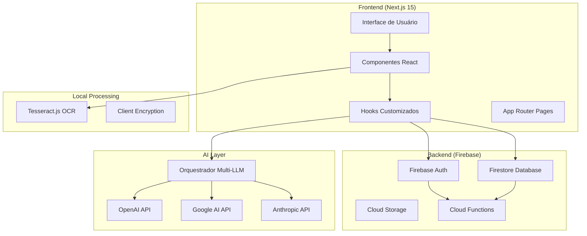
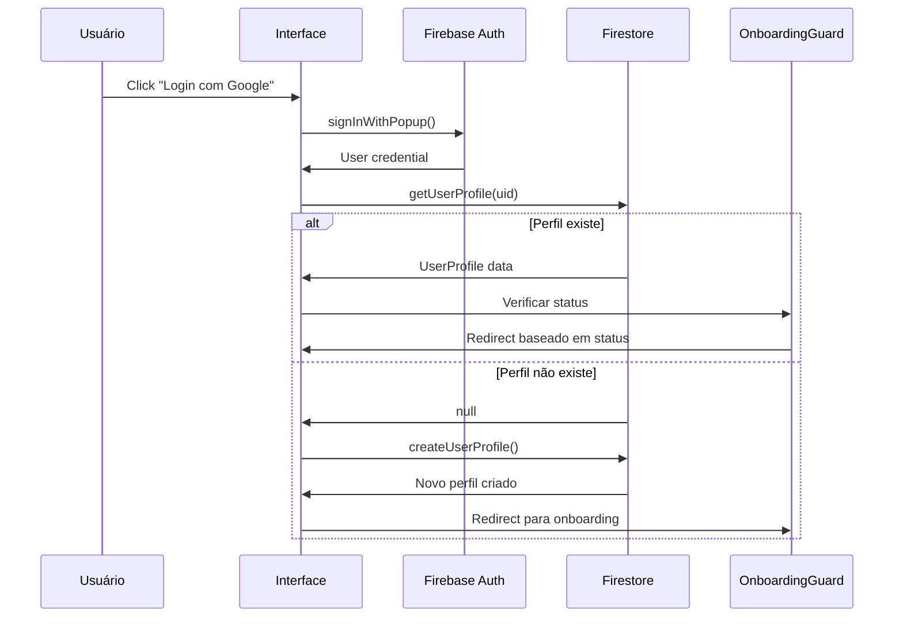
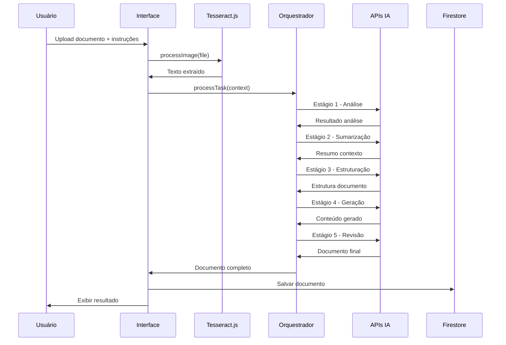
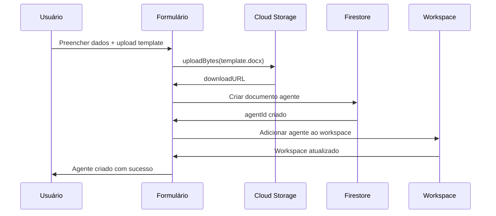

# 🏗️ Architecture Documentation - LexAI

> **📊 Status:** Arquitetura implementada e estável | **📅 Última Atualização:** Dezembro 2024

## 📖 Visão Geral

LexAI é uma aplicação **Full-Stack TypeScript** construída com arquitetura **moderna, modular e escalável**. O sistema combina **Next.js 15**, **Firebase** e **orquestração multi-LLM** para entregar uma plataforma SaaS jurídica robusta e performática.

### **🎯 Princípios Arquiteturais**

1. **Modularidade**: Componentes independentes e reutilizáveis
2. **Type Safety**: TypeScript rigoroso em toda a aplicação
3. **Performance**: SSR, otimizações e carregamento eficiente
4. **Segurança**: Isolamento de dados e compliance LGPD
5. **Escalabilidade**: Arquitetura preparada para crescimento
6. **Developer Experience**: Ferramentas e padrões consistentes

---

## 🏛️ Arquitetura de Alto Nível



---

## 📂 Estrutura de Diretórios Detalhada

```
studio-1/
├── 📁 src/                           # Código fonte principal
│   ├── 📁 app/                       # Next.js App Router
│   │   ├── 📁 (auth)/               # Grupo de rotas autenticação
│   │   │   ├── login/page.tsx       # Página de login
│   │   │   └── signup/page.tsx      # Página de cadastro
│   │   ├── 📁 api/                  # API Routes do Next.js
│   │   │   ├── generate/route.ts    # Endpoint geração documentos
│   │   │   └── orchestrator/        # APIs do orquestrador
│   │   ├── 📁 agente/               # Gestão de agentes
│   │   ├── 📁 generate/             # Interface de geração
│   │   ├── 📁 workspace/            # Gestão de workspaces
│   │   ├── globals.css              # Estilos globais
│   │   └── layout.tsx               # Layout raiz
│   │
│   ├── 📁 components/               # Componentes React
│   │   ├── 📁 ui/                   # shadcn/ui base components
│   │   │   ├── button.tsx           # Componente Button
│   │   │   ├── card.tsx             # Componente Card
│   │   │   └── ...                  # Outros componentes base
│   │   ├── 📁 layout/               # Componentes de layout
│   │   │   ├── header.tsx           # Cabeçalho da aplicação
│   │   │   ├── sidebar.tsx          # Barra lateral
│   │   │   └── onboarding-guard.tsx # Guard de onboarding
│   │   ├── 📁 forms/                # Formulários específicos
│   │   ├── 📁 auth/                 # Componentes autenticação
│   │   └── 📁 ocr/                  # Componentes OCR
│   │
│   ├── 📁 hooks/                    # Hooks customizados
│   │   ├── use-auth.tsx             # Hook de autenticação
│   │   ├── use-ocr.tsx              # Hook de OCR
│   │   └── use-toast.ts             # Hook de notificações
│   │
│   ├── 📁 services/                 # Serviços e integrações
│   │   ├── user-service.ts          # Serviços de usuário
│   │   └── firebase-service.ts      # Integrações Firebase
│   │
│   ├── 📁 lib/                      # Utilitários e configurações
│   │   ├── firebase.ts              # Configuração Firebase
│   │   ├── firebase-admin.ts        # Firebase Admin SDK
│   │   └── utils.ts                 # Utilitários gerais
│   │
│   └── 📁 ai/orchestrator/          # Sistema de IA
│       ├── index.ts                 # Interface principal
│       ├── types.ts                 # Tipos TypeScript
│       ├── config.ts                # Configurações LLM
│       ├── router.ts                # Roteador multi-LLM
│       ├── pipeline.ts              # Pipeline principal
│       ├── processors.ts            # Processadores por etapa
│       └── 📁 clients/              # Clientes para APIs IA
│
├── 📁 public/                       # Assets estáticos
├── 📁 docs/                         # Documentação adicional
├── 📄 package.json                  # Dependências e scripts
├── 📄 tsconfig.json                 # Configuração TypeScript
├── 📄 tailwind.config.js            # Configuração Tailwind
├── 📄 next.config.js                # Configuração Next.js
└── 📄 firebase.json                 # Configuração Firebase
```

---

## 🔧 Stack Tecnológica Detalhada

### **Frontend (Cliente)**

#### **Next.js 15**
- **App Router**: Roteamento moderno com layouts aninhados
- **Server Components**: Renderização server-side otimizada
- **Turbopack**: Build tool performático para desenvolvimento
- **Image Optimization**: Otimização automática de imagens
- **Route Handlers**: APIs internas do Next.js

#### **React 18**
- **Functional Components**: Apenas componentes funcionais
- **Hooks**: useState, useEffect, useCallback, useMemo
- **Context API**: Gerenciamento de estado global (Auth)
- **Suspense**: Loading states e lazy loading
- **Error Boundaries**: Tratamento robusto de erros

#### **TypeScript 5**
- **Strict Mode**: Configuração rigorosa de tipos
- **Interface-First**: Definição clara de contratos
- **Generics**: Reutilização de tipos complexos
- **Module Resolution**: Imports organizados com aliases
- **JSDoc**: Documentação inline de APIs

#### **Styling & UI**
```typescript
// Stack de UI/UX
{
  "framework": "Tailwind CSS 3.4",
  "components": "shadcn/ui",
  "animations": "Framer Motion",
  "icons": "Lucide React",
  "themes": "next-themes",
  "responsive": "Mobile-first design"
}
```

### **Backend (Servidor)**

#### **Firebase Suite**
```typescript
// Configuração Firebase
{
  "auth": "Firebase Authentication v10",
  "database": "Cloud Firestore",
  "storage": "Cloud Storage",
  "functions": "Cloud Functions (Node.js)",
  "hosting": "Firebase Hosting",
  "analytics": "Google Analytics 4"
}
```

#### **Banco de Dados (Firestore)**
```javascript
// Estrutura de dados principal
{
  usuarios: {
    [uid]: {
      cargo: string,
      areas_atuacao: string[],
      primeiro_acesso: boolean,
      initial_setup_complete: boolean,
      data_criacao: Timestamp,
      workspaces: Workspace[]
    }
  },
  
  workspaces: {
    [workspaceId]: {
      name: string,
      owner_uid: string,
      members: string[],
      created_at: Timestamp,
      agents: Reference[]
    }
  },
  
  agents: {
    [agentId]: {
      name: string,
      description: string,
      template_url: string,
      config: AgentConfig,
      workspace_id: string,
      created_by: string
    }
  },
  
  documents: {
    [documentId]: {
      title: string,
      content: string,
      agent_id: string,
      user_id: string,
      status: 'processing' | 'completed' | 'error',
      created_at: Timestamp
    }
  }
}
```

### **AI Layer (Inteligência Artificial)**

#### **Orquestrador Multi-LLM**
```typescript
// Arquitetura do orquestrador
interface OrchestrationPipeline {
  // Estágio 1: Análise de entrada
  inputAnalysis: {
    processor: 'analyze_input',
    llm: 'google' | 'openai',
    cost: 'low'
  },
  
  // Estágio 2: Sumarização de contexto
  contextSummarization: {
    processor: 'summarize_context',
    llm: 'google' | 'openai',
    cost: 'low'
  },
  
  // Estágio 3: Estruturação do documento
  documentStructuring: {
    processor: 'structure_document',
    llm: 'openai' | 'anthropic',
    cost: 'medium'
  },
  
  // Estágio 4: Geração por seção
  sectionGeneration: {
    processor: 'generate_section',
    llm: 'openai' | 'anthropic',
    cost: 'high'
  },
  
  // Estágio 5: Revisão e montagem
  reviewAndAssembly: {
    processor: 'review_and_assemble',
    llm: 'anthropic' | 'openai',
    cost: 'medium'
  }
}
```

#### **Providers de IA Suportados**
```typescript
// Configuração multi-LLM
{
  "openai": {
    "models": ["gpt-4", "gpt-3.5-turbo"],
    "use_cases": ["generation", "analysis"],
    "cost_per_token": 0.00003,
    "rate_limits": "90k tokens/min"
  },
  
  "google": {
    "models": ["gemini-pro", "gemini-pro-vision"],
    "use_cases": ["summarization", "classification"],
    "cost_per_token": 0.00001,
    "rate_limits": "60 requests/min"
  },
  
  "anthropic": {
    "models": ["claude-3-opus", "claude-3-sonnet"],
    "use_cases": ["complex_reasoning", "review"],
    "cost_per_token": 0.00005,
    "rate_limits": "50k tokens/min"
  }
}
```

---

## 🔄 Fluxos de Dados Principais

### **1. Fluxo de Autenticação**



### **2. Fluxo de Geração de Documento**



### **3. Fluxo de Criação de Agente**



---

## 🔒 Segurança e Compliance

### **Autenticação e Autorização**

#### **Firebase Authentication**
```typescript
// Regras de segurança implementadas
{
  "authentication": {
    "providers": ["email/password", "google.com"],
    "mfa": "optional",
    "session_management": "firebase_handled"
  },
  
  "authorization": {
    "model": "RBAC (Role-Based Access Control)",
    "levels": ["user", "workspace_member", "workspace_owner"],
    "enforcement": "firestore_rules + app_level"
  }
}
```

#### **Firestore Security Rules**
```javascript
// Regras de acesso aos dados
rules_version = '2';
service cloud.firestore {
  match /databases/{database}/documents {
    // Usuários - acesso próprio apenas
    match /usuarios/{userId} {
      allow read, write: if request.auth != null 
        && request.auth.uid == userId;
    }
    
    // Workspaces - membros apenas
    match /workspaces/{workspaceId} {
      allow read, write: if request.auth != null 
        && request.auth.uid in resource.data.members;
    }
    
    // Documentos - isolamento por usuário
    match /documents/{documentId} {
      allow read, write: if request.auth != null 
        && request.auth.uid == resource.data.user_id;
    }
  }
}
```

### **Proteção de Dados (LGPD)**

#### **Processamento Local**
```typescript
// OCR 100% local - dados não saem do browser
const ocrResult = await worker.recognize(imageFile, {
  localProcessing: true,
  noServerUpload: true,
  dataRetention: 'session_only'
});
```

#### **Criptografia e Armazenamento**
```typescript
// Configurações de segurança
{
  "data_encryption": {
    "at_rest": "Firebase managed encryption",
    "in_transit": "TLS 1.3",
    "client_side": "Web Crypto API (quando necessário)"
  },
  
  "data_retention": {
    "user_data": "Até exclusão da conta",
    "documents": "Política definida pelo usuário",
    "logs": "30 dias máximo",
    "temporary_files": "Session-based cleanup"
  },
  
  "compliance": {
    "lgpd": "Implemented",
    "privacy_by_design": "Yes",
    "user_consent": "Explicit and granular",
    "data_portability": "Planned Q1 2025"
  }
}
```

---

## ⚡ Performance e Otimizações

### **Frontend Performance**

#### **Next.js Optimizations**
```typescript
// Configurações de performance
{
  "rendering": {
    "strategy": "Hybrid SSR/CSR",
    "caching": "Automatic with revalidation",
    "code_splitting": "Route-based + dynamic imports"
  },
  
  "assets": {
    "images": "Next.js Image component",
    "fonts": "Self-hosted + preload",
    "css": "Tailwind JIT compilation"
  },
  
  "bundle": {
    "tool": "Turbopack (dev) / Webpack (prod)",
    "tree_shaking": "Enabled",
    "compression": "Gzip + Brotli"
  }
}
```

#### **React Optimizations**
```typescript
// Estratégias de otimização React
{
  "memoization": {
    "components": "React.memo para heavy components",
    "values": "useMemo para computações caras",
    "callbacks": "useCallback para event handlers"
  },
  
  "lazy_loading": {
    "routes": "Dynamic imports",
    "components": "React.lazy + Suspense",
    "images": "Intersection Observer"
  },
  
  "state_management": {
    "local": "useState + useReducer",
    "global": "Context API (auth only)",
    "remote": "SWR pattern para cache"
  }
}
```

### **Backend Performance**

#### **Firebase Optimizations**
```typescript
// Otimizações Firebase
{
  "firestore": {
    "indexes": "Composite indexes para queries complexas",
    "queries": "Limitadas + paginação",
    "caching": "Offline persistence habilitado"
  },
  
  "storage": {
    "compression": "Automática para imagens",
    "cdn": "Global CDN do Firebase",
    "metadata": "Minimal para performance"
  },
  
  "functions": {
    "cold_starts": "Minimizados com keep-warm",
    "memory": "Adequada por função",
    "timeout": "Configurado por use case"
  }
}
```

---

## 🧪 Testing Strategy

### **Tipos de Teste Implementados**

#### **Unit Testing**
```typescript
// Framework de testes
{
  "framework": "Jest + React Testing Library",
  "coverage": {
    "hooks": "useAuth, useOCR - 90%+",
    "utilities": "lib/ functions - 95%+",
    "components": "Critical UI - 70%+"
  },
  
  "mocking": {
    "firebase": "Firebase emulators",
    "apis": "MSW (Mock Service Worker)",
    "llm_responses": "Fixture-based mocks"
  }
}
```

#### **Integration Testing**
```typescript
// Testes de integração
{
  "scope": [
    "Auth flow completo",
    "Document generation pipeline", 
    "OCR processing workflow",
    "Agent creation process"
  ],
  
  "tools": {
    "e2e": "Playwright (planejado)",
    "api": "Supertest para API routes",
    "database": "Firebase emulators"
  }
}
```

### **Manual Testing Checklist**
```typescript
// Checklist de testes manuais
{
  "authentication": [
    "✅ Login email/password",
    "✅ Login Google OAuth", 
    "✅ Logout e cleanup",
    "✅ Session persistence"
  ],
  
  "core_features": [
    "✅ Agent creation",
    "✅ Document upload + OCR",
    "✅ AI pipeline execution",
    "✅ Document generation"
  ],
  
  "edge_cases": [
    "🔄 Network failures",
    "🔄 Large file uploads",
    "🔄 API rate limits",
    "🔄 Concurrent users"
  ]
}
```

---

## 🚀 Deploy e DevOps

### **Ambientes**

#### **Development**
```typescript
{
  "hosting": "Local (localhost:3000)",
  "database": "Firebase Emulators",
  "apis": "Development keys",
  "features": "All features + debug tools"
}
```

#### **Staging/Beta**
```typescript
{
  "hosting": "Firebase Hosting (beta subdomain)",
  "database": "Firestore (staging project)",
  "apis": "Limited quota API keys",
  "features": "Production-like environment"
}
```

#### **Production**
```typescript
{
  "hosting": "Firebase Hosting + CDN",
  "database": "Firestore (production)",
  "apis": "Production API keys com quotas",
  "monitoring": "Firebase Analytics + Error Reporting"
}
```

### **CI/CD Pipeline**

```yaml
# Fluxo de deploy automatizado
name: Deploy Pipeline
on:
  push:
    branches: [main]

jobs:
  test:
    - TypeScript compilation
    - ESLint validation
    - Unit tests execution
    - Build verification
  
  deploy-staging:
    - Deploy to Firebase Hosting (staging)
    - Run integration tests
    - Performance audit
  
  deploy-production:
    - Manual approval required
    - Deploy to Firebase Hosting (prod)
    - Health check monitoring
    - Rollback if issues detected
```

---

## 🔮 Evolução Arquitetural

### **Próximas Implementações (Q1 2025)**

#### **Backend Enhancements**
```typescript
{
  "apis": {
    "public_rest": "OpenAPI spec + authentication",
    "rate_limiting": "Por usuário e endpoint",
    "webhooks": "Event-driven integrations"
  },
  
  "database": {
    "analytics": "Document usage metrics",
    "audit_logs": "User actions tracking",
    "backup_strategy": "Automated with retention"
  }
}
```

#### **AI Improvements**
```typescript
{
  "pipeline": {
    "streaming": "Real-time progress updates",
    "personalization": "User-specific optimizations",
    "quality_metrics": "Confidence scoring"
  },
  
  "providers": {
    "additional_llms": "Cohere, Mistral integration",
    "cost_optimization": "Dynamic provider selection",
    "failover": "Robust error handling"
  }
}
```

### **Escalabilidade Futura**

#### **Microservices Migration**
```typescript
// Arquitetura futura (v2.0)
{
  "auth_service": "Dedicated authentication microservice",
  "document_service": "Document processing pipeline",
  "ai_service": "LLM orchestration service", 
  "notification_service": "Real-time notifications",
  "analytics_service": "Usage metrics and insights"
}
```

#### **Multi-tenancy Evolution**
```typescript
{
  "current": "Workspace-based soft tenancy",
  "future": "Database-per-tenant isolation",
  "enterprise": "On-premise deployment support"
}
```

---

## 📊 Métricas e Monitoramento

### **Application Metrics**
```typescript
{
  "performance": {
    "page_load": "< 2s (95th percentile)",
    "api_response": "< 500ms average",
    "ocr_processing": "< 10s por página",
    "document_generation": "< 30s média"
  },
  
  "reliability": {
    "uptime": "99.9% target",
    "error_rate": "< 1% objetivo",
    "success_rate": "95%+ para document generation"
  },
  
  "user_experience": {
    "bounce_rate": "< 20%",
    "completion_rate": "80%+ onboarding",
    "satisfaction": "NPS > 50"
  }
}
```

### **Technical Metrics**
```typescript
{
  "code_quality": {
    "test_coverage": "80%+ objetivo",
    "type_coverage": "95%+ TypeScript",
    "lint_score": "100% compliance"
  },
  
  "security": {
    "vulnerability_scans": "Weekly automated",
    "dependency_updates": "Monthly review",
    "penetration_testing": "Quarterly"
  }
}
```

---

## 🤝 Contributing to Architecture

### **Architecture Decision Records (ADRs)**

Decisões arquiteturais importantes são documentadas em:
- `docs/adrs/` - Arquivo de decisões
- **Template**: Problema → Alternativas → Decisão → Consequências

### **Code Review Guidelines**

```typescript
// Checklist para reviews arquiteturais
{
  "structure": "Segue padrões estabelecidos?",
  "performance": "Impacto em performance considerado?",
  "security": "Implicações de segurança avaliadas?",
  "scalability": "Suporta crescimento futuro?",
  "maintainability": "Código limpo e documentado?"
}
```

---

**🏗️ Esta arquitetura representa o estado atual do LexAI e serve como guia para desenvolvimento futuro. Mantendo-se atualizada com as evoluções do sistema.**