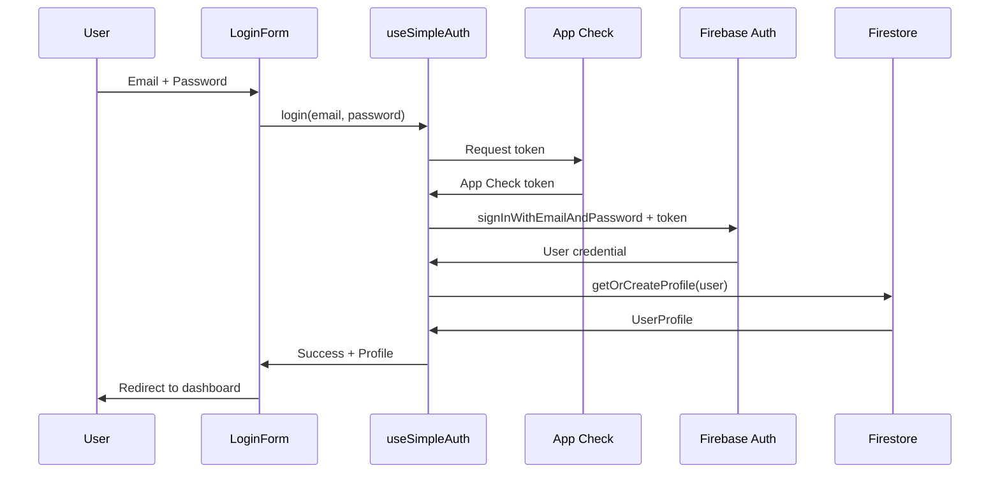
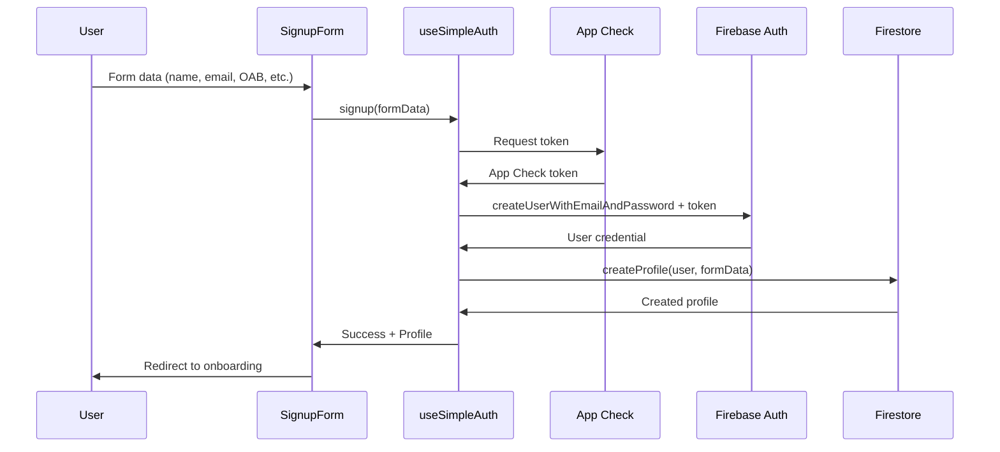
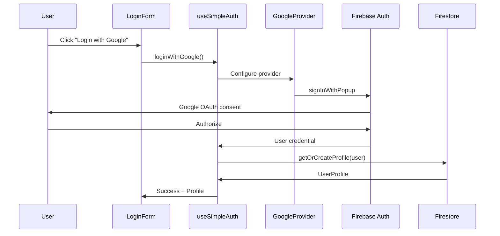

# 🔐 Arquitetura de Autenticação - LexAI

> **Sistema robusto e seguro para autenticação de usuários jurídicos**

---

## 📋 **Visão Geral**

O sistema de autenticação do LexAI é projetado para atender às necessidades específicas de profissionais jurídicos, com foco em segurança, compliance e experiência do usuário.

### **Características Principais**
- 🛡️ **Firebase Authentication** com App Check
- 📊 **Perfis jurídicos** com dados OAB e especialização
- 🔄 **Multiple providers** (Email/Senha + Google OAuth)
- 📱 **Responsive design** otimizado para mobile
- 🎯 **Onboarding inteligente** para primeiros acessos

---

## 🏗️ **Arquitetura Técnica**

### **Stack Tecnológico**
```typescript
Frontend:     React 18 + Next.js 14 + TypeScript
Auth Provider: Firebase Authentication v10
Database:     Cloud Firestore
UI Framework: shadcn/ui + Tailwind CSS
State:        React Context + Custom hooks
Security:     Firebase App Check + reCAPTCHA v3
```

### **Estrutura de Camadas**
```
┌─────────────────────────────────────────┐
│             UI Layer                    │
│  LoginForm | SignupForm | AuthGuard     │
├─────────────────────────────────────────┤
│           Business Logic                │
│  useSimpleAuth | UserService | Routing  │
├─────────────────────────────────────────┤
│          Integration Layer              │
│  Firebase Auth | App Check | Firestore │
├─────────────────────────────────────────┤
│           Security Layer                │
│  Rules | Rate Limiting | Monitoring     │
└─────────────────────────────────────────┘
```

---

## 🔄 **Fluxos de Autenticação**

### **1. Fluxo de Login**


### **2. Fluxo de Cadastro**


### **3. Fluxo de OAuth Google**


---

## 📊 **Modelo de Dados**

### **Firebase User (Nativo)**
```typescript
interface FirebaseUser {
  uid: string;              // ID único
  email: string | null;     // Email principal
  displayName: string | null; // Nome do Google
  photoURL: string | null;  // Avatar
  emailVerified: boolean;   // Email verificado
  providerId: string;       // 'password' | 'google.com'
}
```

### **UserProfile (Customizado)**
```typescript
interface UserProfile {
  // Dados pessoais
  name?: string;
  displayName?: string;
  email?: string;
  phone?: string;
  
  // Dados profissionais
  company?: string;         // Escritório/Empresa
  oab?: string;            // Número OAB
  cargo: string;           // Advogado, Estagiário, etc.
  areas_atuacao: string[]; // Direito Civil, Criminal, etc.
  
  // Controle de sistema
  primeiro_acesso: boolean;
  initial_setup_complete: boolean;
  data_criacao: Timestamp;
  
  // Workspaces
  workspaces: Workspace[];
}
```

### **Coleções Firestore**
```
/usuarios/{userId}          → UserProfile
/workspaces/{workspaceId}   → Workspace data
/sessions/{sessionId}       → Session tracking (opcional)
```

---

## 🔒 **Segurança e Compliance**

### **Firebase Security Rules**
```javascript
rules_version = '2';
service cloud.firestore {
  match /databases/{database}/documents {
    // Usuários só podem acessar próprio perfil
    match /usuarios/{userId} {
      allow read, write: if request.auth != null 
        && request.auth.uid == userId;
    }
    
    // Workspaces: apenas membros autorizados
    match /workspaces/{workspaceId} {
      allow read, write: if request.auth != null 
        && request.auth.uid in resource.data.members;
    }
  }
}
```

### **App Check Protection**
```typescript
// Produção: reCAPTCHA v3
const appCheck = initializeAppCheck(app, {
  provider: new ReCaptchaV3Provider(process.env.RECAPTCHA_SITE_KEY!),
  isTokenAutoRefreshEnabled: true
});

// Desenvolvimento: Debug tokens
const appCheck = initializeAppCheck(app, {
  provider: new CustomProvider({
    getToken: () => Promise.resolve({
      token: process.env.APP_CHECK_DEBUG_TOKEN!,
      expireTimeMillis: Date.now() + 60 * 60 * 1000
    })
  })
});
```

### **Rate Limiting**
```typescript
// Firebase nativo: 100 tentativas/hora/IP
// Customizado: 5 tentativas/minuto por email
// Progressivo: Delays exponenciais após falhas
```

---

## 🎯 **Estados e Contexto**

### **SimpleAuthContext**
```typescript
interface SimpleAuthContextType {
  // Estado
  user: User | null;           // Firebase user
  profile: UserProfile | null; // Perfil Firestore
  loading: boolean;           // Loading state
  error: AuthError | null;    // Últimos erros
  isInitialized: boolean;     // Auth inicializado
  
  // Ações
  login: (email: string, password: string) => Promise<void>;
  signup: (data: SignupData) => Promise<void>;
  loginWithGoogle: () => Promise<void>;
  logout: () => Promise<void>;
  resetPassword: (email: string) => Promise<void>;
  
  // Utilitários
  clearError: () => void;
  updateProfile: (updates: Partial<UserProfile>) => Promise<void>;
  refetchProfile: () => Promise<void>;
}
```

### **Estado Global**
```typescript
// Context hierarchy
<SimpleAuthProvider>         // Auth state
  <WorkspaceProvider>        // Workspace state
    <OnboardingGuard>        // Route protection
      <App />
    </OnboardingGuard>
  </WorkspaceProvider>
</SimpleAuthProvider>
```

---

## 🔧 **Componentes Principais**

### **Hook Principal: useSimpleAuth**
```typescript
const { 
  user,           // Firebase user
  profile,        // Perfil completo
  loading,        // Estado loading
  login,          // Login email/senha
  loginWithGoogle, // OAuth Google
  signup,         // Registro
  logout          // Logout
} = useSimpleAuth();
```

### **Componentes de UI**
```typescript
<LoginForm />           // Form de login
<SignupForm />          // Form de cadastro
<ForgotPasswordForm />  // Recuperação de senha
<AuthErrorBoundary>     // Error boundary especializado
  <ProtectedContent />
</AuthErrorBoundary>
```

### **Guards e Proteção**
```typescript
<OnboardingGuard>       // Redireciona se setup incompleto
<AuthGuard>            // Protege rotas autenticadas
<RoleGuard role="admin"> // Protege por papel (futuro)
```

---

## 📈 **Monitoramento e Observabilidade**

### **Métricas Principais**
```typescript
// Performance
- Login success rate
- Average login time
- Token refresh frequency

// Security
- Failed login attempts
- Suspicious activity patterns
- App Check rejections

// Business
- User registration rate
- OAuth vs email preference
- Onboarding completion rate
```

### **Logging Estruturado**
```typescript
// Format padrão
{
  timestamp: ISO8601,
  level: 'info' | 'warn' | 'error',
  event: 'auth.login.success',
  userId?: string,
  metadata: {
    provider: 'password' | 'google',
    duration: number,
    userAgent: string
  }
}
```

### **Error Tracking**
```typescript
// Categorias de erro
- AuthenticationError  // Credenciais inválidas
- NetworkError        // Problemas de conectividade
- AppCheckError       // Falhas App Check
- FirestoreError      // Problemas de banco
- ValidationError     // Dados inválidos
```

---

## 🚀 **Deployment e Environments**

### **Environment Configuration**
```bash
# Development
NEXT_PUBLIC_APP_ENV=development
NEXT_PUBLIC_FIREBASE_PROJECT_ID=lexai-ef0ab-dev
APP_CHECK_DEBUG_TOKEN=your-debug-token

# Staging
NEXT_PUBLIC_APP_ENV=staging
NEXT_PUBLIC_FIREBASE_PROJECT_ID=lexai-ef0ab-staging
RECAPTCHA_SITE_KEY=your-staging-key

# Production
NEXT_PUBLIC_APP_ENV=production
NEXT_PUBLIC_FIREBASE_PROJECT_ID=lexai-ef0ab
RECAPTCHA_SITE_KEY=your-production-key
```

### **Conditional Loading**
```typescript
// App Check apenas em produção
const shouldInitializeAppCheck = 
  process.env.NEXT_PUBLIC_APP_ENV === 'production' &&
  typeof window !== 'undefined';

if (shouldInitializeAppCheck) {
  initializeAppCheck(app, appCheckConfig);
}
```

---

## 🛠️ **Maintenance e Troubleshooting**

### **Comandos Úteis**
```bash
# Verificar configuração
node scripts/debug-auth.js

# Testar conectividade Firebase
npm run test:firebase

# Verificar regras de segurança
firebase firestore:rules:get

# Deploy apenas auth rules
firebase deploy --only firestore:rules
```

### **Problemas Comuns**

| Problema | Causa | Solução |
|----------|-------|---------|
| Erro 400 auth | App Check mal configurado | Verificar reCAPTCHA keys |
| Profile null | Firestore rules restritivas | Verificar permissions |
| Login lento | Network issues | Implementar retry logic |
| Token expired | Refresh automático falhou | Force refresh manual |

### **Health Checks**
```typescript
// Verificação de saúde do sistema
const healthCheck = async () => {
  const checks = {
    firebase: await testFirebaseConnection(),
    firestore: await testFirestoreRead(),
    appCheck: await testAppCheckToken(),
    auth: await testAuthEndpoint()
  };
  
  return checks;
};
```

---

## 📚 **Referências e Recursos**

### **Documentação Externa**
- [Firebase Authentication](https://firebase.google.com/docs/auth)
- [Firebase App Check](https://firebase.google.com/docs/app-check)
- [Next.js Authentication](https://nextjs.org/docs/authentication)
- [React Context Patterns](https://react.dev/reference/react/useContext)

### **Arquivos de Configuração**
- `src/lib/firebase.ts` - Configuração principal
- `src/hooks/use-simple-auth.tsx` - Hook de autenticação
- `firestore.rules` - Regras de segurança
- `.env.local` - Variáveis de ambiente

### **Scripts e Utilitários**
- `scripts/debug-auth.js` - Diagnóstico
- `scripts/fix-auth-400.sh` - Correção de erros
- `scripts/test-firebase.js` - Testes de conectividade

---

**📅 Última atualização**: Dezembro 2024
**🔄 Próxima revisão**: Implementação do App Check completo